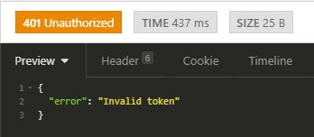
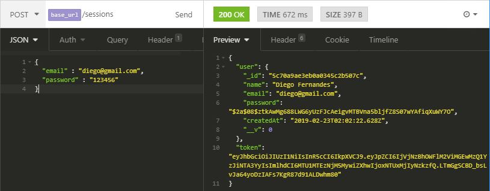
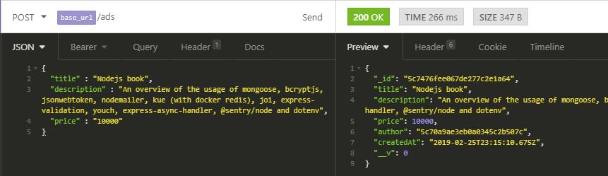
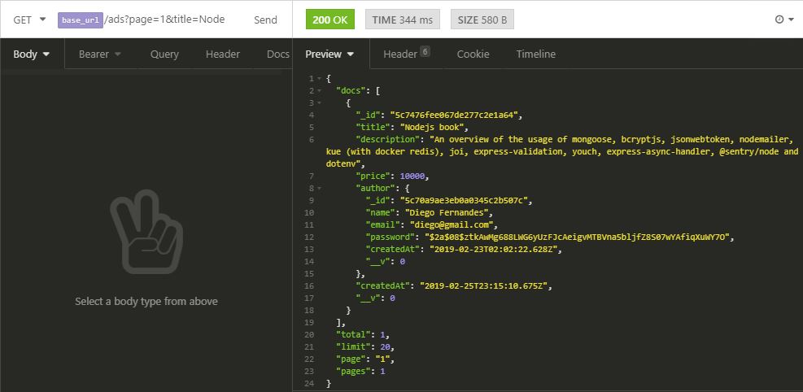
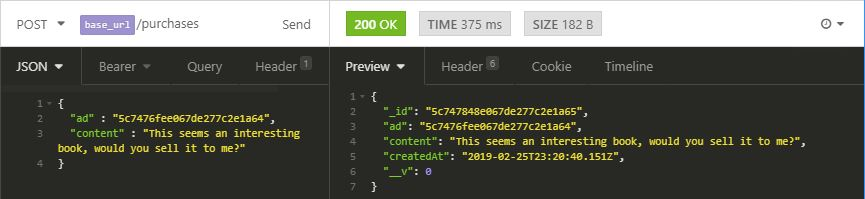
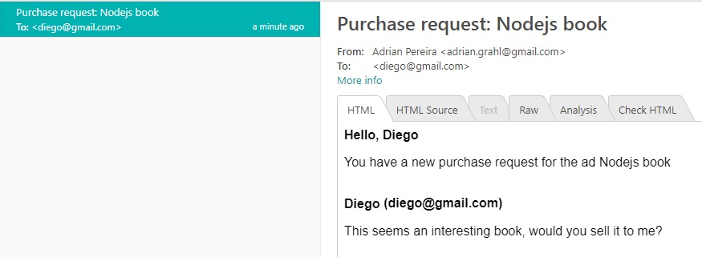
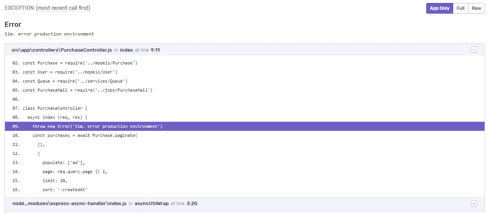

# App Marketplace (Nodejs)
REST API, overview of the usage of mongoose, bcryptjs, jsonwebtoken, nodemailer, kue (with docker redis), joi, express-validation, youch, express-async-handler, @sentry/node and dotenv

**.env file entries:**

* NODE_ENV=
* APP_SECRET=
* HOST=
* DB_URL=
* MAIL_HOST=
* MAIL_PORT=
* MAIL_USER=
* MAIL_PASS=
* REDIS_HOST=
* REDIS_PORT=
* SENTRY_DSN=

## Installing

**Yarn package manager:** you can start by installing yarn at https://yarnpkg.com/en/docs/install

**Node:** https://nodejs.org/en/

**Docker(optional):** https://www.docker.com/get-started

docker run --name mongonode -p 27017:27017 -d -t mongo

docker run --name noderedis -p 6379:6379 -d -t redis:alpine

Run **yarn** command into the project's tree to install all dependencies

Run **yarn start**

# Features

Creation of users and json web token validation

CRUD of Ads with mongoose paginate

Queue (kue + redis) to send e-mails with purchase intentios (nodemailer + mailtrap.io)

Sentry.io to notify errors in production env

